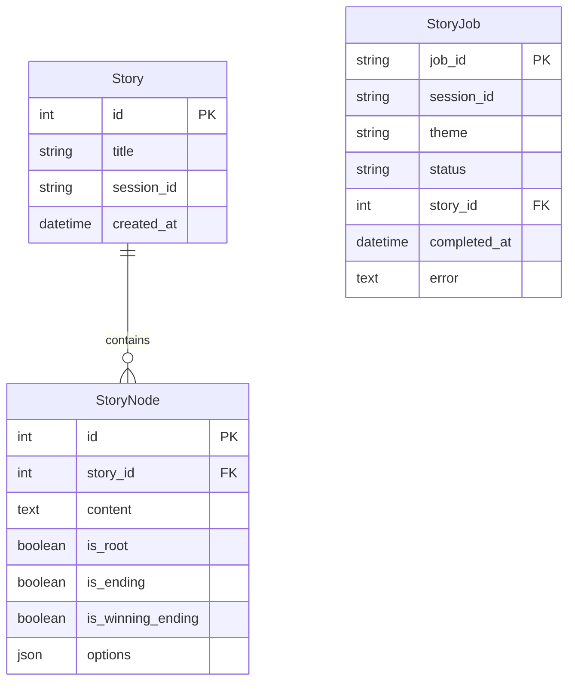

# 🎭 Adventure AI

> **An AI-powered choose-your-own-adventure story generator that creates immersive, branching narratives tailored to your imagination.**

[](https://fastapi.tiangolo.com/)
[](https://reactjs.org/)
[](https://openai.com/)
[](https://langchain.com/)

## 🌐 Live Demo

# click-->[Try Adventure AI Now](https://adventure-ai.onrender.com/) - Experience the magic of AI-generated stories!

## ✨ Features

🎨 **Theme-Based Generation** - Create stories with your preferred themes (fantasy, sci-fi, mystery, etc.)  
🌳 **Complex Branching** - Deep story trees with 8+ levels and multiple endings  
🏆 **Multiple Endings** - Experience winning and losing conclusions based on your choices  
⚡ **Real-time Generation** - Watch your story come to life with live status updates  
🔄 **Replayability** - Restart stories or generate completely new adventures  
📱 **Responsive Design** - Seamless experience across all devices  

## 🚀 Quick Start

### Prerequisites

- Python 3.11+
- Node.js 18+
- OpenAI API key 

### Backend Setup

```bash
cd backend
pip install -r requirements.txt

# Set your environment variables
export OPENAI_API_KEY="your-openai-api-key"

# Initialize database
python reset_database.py

# Start the server
python main.py
```

The API will be available at `http://localhost:8000`  
📚 **API Documentation**: `http://localhost:8000/docs`

### Frontend Setup

```bash
cd frontend
npm install
npm run dev
```

The app will be available at `http://localhost:5173`

## 🎮 How It Works

1. **Choose Your Theme** 🎯  
   Enter any theme you desire - from "cyberpunk detective" to "medieval dragon quest"

2. **AI Generates Your Story** 🤖  
   Our advanced AI creates a rich, branching narrative with:
   - Detailed scenes (60-140 words each)
   - Meaningful choices that affect the story
   - Multiple paths leading to different endings

3. **Make Your Choices** 🛤️  
   Navigate through the story by selecting from 2-4 options at each decision point

4. **Experience Multiple Endings** 🎭  
   Discover winning and losing endings based on your decisions

## 🏗️ Architecture

```
Adventure AI
├── 🖥️  Backend (FastAPI + Python)
│   ├── 🤖 AI Story Generation (LangChain + OpenAI)
│   ├── 📊 SQLAlchemy Database
│   ├── 🔄 Background Job Processing
│   └── 📡 REST API
│
└── 🎨 Frontend (React + Vite)
    ├── 🎮 Interactive Story Player
    ├── 📱 Responsive UI Components
    └── ⚡ Real-time Status Updates
```

### Key Components

- **Story Generator**: Uses LangChain and OpenAI to create complex branching narratives
- **Background Jobs**: Handles story generation asynchronously with status tracking  
- **Database Models**: SQLAlchemy models for stories, nodes, and job tracking
- **React Components**: Modular UI for story input, generation, and gameplay

## 🛠️ API Endpoints

| Method | Endpoint | Description |
|--------|----------|-------------|
| `POST` | `/api/stories/create` | Start story generation with theme |
| `GET` | `/api/jobs/{job_id}` | Check story generation status |
| `GET` | `/api/stories/{story_id}/complete` | Retrieve complete story tree |

## 🎯 Story Generation Features

- **Minimum 8 levels deep** before any ending
- **At least one path reaches 12+ levels**
- **Diverse choice types**: tactical, moral, exploratory, and compound actions
- **Rich descriptions**: 60-140 words per scene with sensory details
- **Consequence system**: Earlier choices affect later options
- **Multiple ending types**: At least 2 winning and 3 losing endings

## 🔧 Configuration

### Environment Variables

```bash
# Backend (.env)
OPENAI_API_KEY=your-openai-api-key
DATABASE_URL=sqlite:///./adventure_ai.db
ALLOWED_ORIGINS=http://localhost:5173

# Frontend
VITE_API_BASE_URL=http://localhost:8000/api
```

### Customizing AI Behavior

Modify `backend/core/prompts.py` to adjust:
- Story complexity and depth
- Writing style and tone
- Choice variety and challenge level

## 📊 Database Schema



## 🤝 Contributing

1. **Fork the repository**
2. **Create a feature branch**: `git checkout -b feature/amazing-feature`
3. **Commit your changes**: `git commit -m 'Add amazing feature'`
4. **Push to the branch**: `git push origin feature/amazing-feature`
5. **Open a Pull Request**

### Development Guidelines

- Follow PEP 8 for Python code
- Use ESLint configuration for JavaScript
- Write descriptive commit messages
- Add tests for new features


## 🌟 Acknowledgments

- **OpenAI** for powerful language models
- **LangChain** for AI orchestration framework
- **FastAPI** for the robust backend framework
- **React** for the interactive frontend

## 📧 Support

Have questions or suggestions? 

- 🐛 **Issues**: [GitHub Issues](https://github.com/prazpc/adventure-ai/issues)
- 💡 **Feature Requests**: [GitHub Discussions](https://github.com/prazpc/adventure-ai/discussions)

---


[⭐ Star this repo](https://github.com/prazpc/adventure-ai) • [🍴 Fork it](https://github.com/prazpc/adventure-ai/fork) • 
